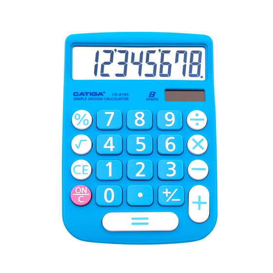

# Calculator

## Image of calculator to reproduce - [source](https://auspowers.com/products/catiga-cd-8185-office-and-home-style-calculator-8-digit-lcd-display-suitable-for-desk-and-on-the-move-use-blue-blue?variant=41366022422708)

## Steps for calculator project

-   Display numbers on screen
-   Create button to reset and clear screen
-   Store first number when an operator key is pressed for first time
-   When a second operator or equals key is pressed store second number
-   If equals is pressed after operator key perform calc on number eg. num1 + num1
-   Repeat last operation every time equals is pressed
-   When two numbers have been entered, calculate result of first and second number
-   Store and display result
-   Add subsequent number to prev result when operator or equals pressed... and so on..

-   Use reduce? reduce if numbers array length === 2
