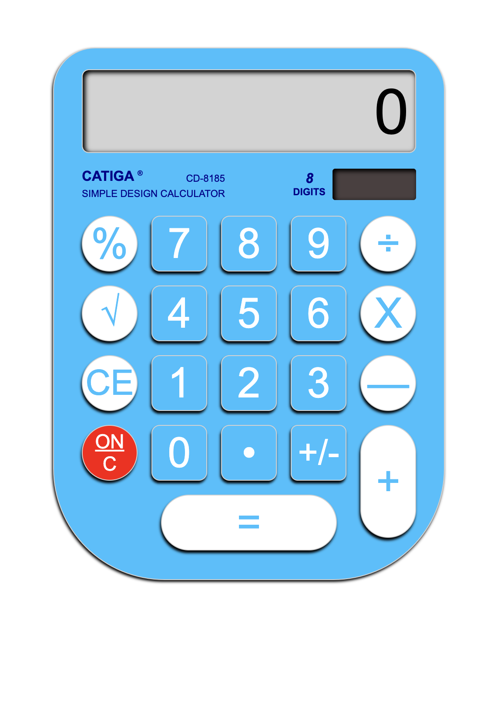
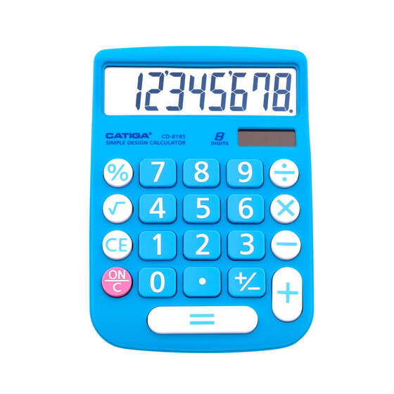

# Calculator

## Description

A simple calculator using HTML, SCSS and JavaScript. You can test the calculator at:

https://kris-martin.github.io/calculator/

## Functions

- +, -, ÷, x operators
- handles decimals
- calculates results of operations 2 numbers at a time and updates screen
- can chain operators together eg. 8 x 8 + 7 - 2 = 69.
  - the calculator first calculates the result of the first 2 numbers, then of the result and the next number and so on...
- pressing equal returns a result
- a result is also shown after two numbers are entered with an operator
- if one number is entered, then an operator and then equals it returns the result of num operator num, eg. If num = 12 and operator = x then it calculates 12 x 12 = 144.
- pressing on/c clears the screen and resets the calculator

## Limitations

- can only press equals once.

## Bugs to fix

- handling for big numbers

## Future features to implement

- % button
- square root button
- CE button
- handling for big numbers
- scientific notation for big numbers
- pressing equal again repeats the last operation

## Project Brief

### MVP

1.  Create a README.md on your Calculator repository that includes a picture of the design you will be reproducing

    ### Image of calculator to reproduce - [source](https://auspowers.com/products/catiga-cd-8185-office-and-home-style-calculator-8-digit-lcd-display-suitable-for-desk-and-on-the-move-use-blue-blue?variant=41366022422708)

    

1.  Using HTML + SCSS, recreate the design that you chose
1.  Create a calculator to be rendered to the html page
1.  it should have number keys from 0 to 9
1.  It should have operator keys (+, -, /, \*, =)
1.  It should also have a “.” key
1.  It should have a display rendering the current calculation in a box at the top
1.  Should render the current calculation in a box at the top (calculator display)
1.  It should handle decimals
1.  It doesn’t need to support orders of operation
1.  It should not use eval() or Function() constructor
1.  Make sure to keep your functions separated from the JS DOM interaction code.
